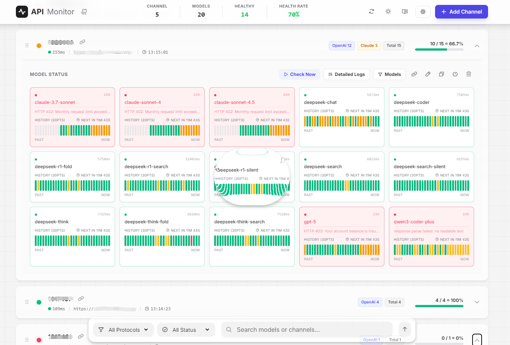
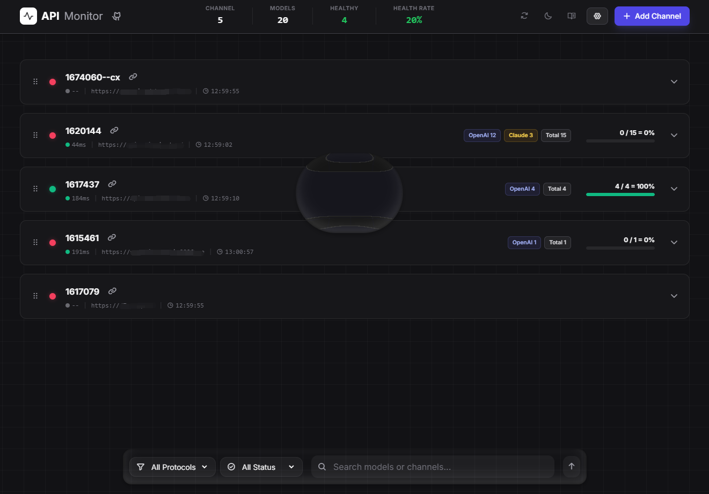

# API Monitor (Go)

`API Monitor (Go)` 是一个面向多渠道 API 的监控与代理工具。

它把这几类能力放在一个 Go 单体应用里：

- 渠道管理与定时巡检
- 模型级可用性检测与历史落库
- 实时 SSE 刷新看板
- 管理后台与运行时设置
- 统一代理网关与代理 Key 管理

仓库地址：`https://github.com/ZhantaoLi/api_monitor_go`


## 预览




## 当前能力

- 渠道管理：新增、编辑、删除、启停监控目标
- 定时巡检：后台扫描到期渠道并触发检测
- 并发检测：目标间并行、目标内模型并发探测
- 模型选择：可为单个渠道限制参与检测的模型集合
- 结果落库：SQLite 保存 `targets`、`runs`、`run_models`、`app_settings`、`proxy_keys`
- 实时刷新：SSE 推送 `run_completed`、`target_updated`、`auth_changed`
- 后台管理：管理员登录、系统设置、资源监控、渠道高级配置
- 渠道排序：主界面拖拽排序，持久化到 `sort_order`
- API 代理：
  - `GET /v1/models`
  - `POST /v1/chat/completions`
  - `POST /v1/messages`
  - `POST /v1/responses`
  - `POST /v1beta/models/{model}:generateContent`
  - `POST /v1beta/models/{model}:streamGenerateContent`

## 技术栈

- 后端：Go `net/http`，使用 Go 1.22+ 路由模式
- 数据库：SQLite（`modernc.org/sqlite`，纯 Go）
- 前端：Go `html/template` + Tailwind + Alpine.js + Chart.js
- 实时：Server-Sent Events (SSE)
- 部署：Docker Compose 或直接运行单二进制

## 快速开始

### Windows 本地运行

推荐直接使用仓库自带脚本：

```powershell
cd api_monitor_go
.\build.ps1
```

`build.ps1` 会固定 `GOCACHE` 和 `GOMODCACHE` 到仓库目录，然后执行：

```powershell
go run .
```

默认访问地址：

- `http://127.0.0.1:8081/`

### 手动运行

```powershell
$env:GOCACHE="$PWD\.gocache"
$env:GOMODCACHE="$PWD\.gomodcache"
go run .
```

### 构建二进制

```bash
CGO_ENABLED=0 go build -trimpath -ldflags="-s -w" -o api-monitor .
```

### Docker 运行

仓库内的 `docker-compose.yml` 当前使用固定镜像版本：

- `lming001/api-monitor-go:v1.3.7`

启动：

```bash
git clone https://github.com/ZhantaoLi/api_monitor_go.git
cd api_monitor_go
docker compose pull
docker compose up -d
```

查看日志：

```bash
docker compose logs -f
```

默认访问地址：

- `http://127.0.0.1:8081/`

如果未显式提供 `API_MONITOR_TOKEN_ADMIN`，首次启动会自动生成管理员 token，并在启动日志中打印。

## 目录结构

```text
api_monitor_go/
├── cmd/
│   └── api-monitor/            # 预留命令目录
├── data/
│   ├── logs/                   # JSONL 检测日志
│   └── registry.db             # SQLite 主数据库
├── internal/
│   ├── admin/                  # 管理后台 handler、设置、资源接口
│   ├── app/                    # 当前为空的历史迁移目录，可忽略
│   ├── auth/                   # Bearer 鉴权、管理员会话、限流、防爆破
│   ├── bootstrap/              # 启动装配、配置加载、路由注册
│   ├── channel/                # 渠道 CRUD、排序、模型选择、日志接口
│   ├── dashboard/              # SSE 事件总线
│   ├── monitor/                # 调度器、模型探测、日志落盘
│   ├── platform/               # 资源监控
│   ├── proxy/                  # 代理路由、模型改写、上游转发
│   ├── store/
│   │   └── sqlite/             # SQLite schema、迁移、CRUD
│   └── view/                   # 页面模板解析与渲染
├── web/
│   ├── assets/
│   │   ├── css/                # 样式
│   │   ├── js/                 # 页面脚本与公共工具
│   │   ├── vendor/             # 本地前端依赖
│   │   └── tailwind.config.js
│   └── templates/
│       ├── layouts/            # 基础布局
│       ├── pages/              # 页面模板
│       └── partials/           # 导航、头部、页脚等公共片段
├── build.ps1                   # Windows 本地运行脚本
├── docker-compose.yml
├── Dockerfile
├── main.go                     # 入口：embed web 并调用 bootstrap.Start
├── preview.png
├── preview-dark.png
└── README.md
```

说明：

- 当前运行时入口是根目录的 `main.go -> bootstrap.Start(webFS)`。
- 页面实际由 `internal/view` 加载 `web/templates/` 渲染。
- `web/` 根目录下保留的少量 `.html` 文件属于历史文件，当前运行时以模板目录为准。

## 核心架构

启动链路：

1. `main.go` 嵌入 `web/*`
2. `bootstrap.Start(...)` 加载配置并初始化 SQLite
3. 解析或生成运行时管理员 / 访客 token
4. 启动 `monitor.MonitorService`
5. 初始化 `dashboard.SSEBus`
6. 初始化 `view.Renderer`
7. 注册页面路由、监控 API、后台 API、代理 API
8. 启动 HTTP 服务并处理优雅关闭

核心职责：

- `bootstrap`：应用装配与生命周期
- `auth`：Bearer 鉴权、管理员 Cookie、代理头信任、防爆破
- `channel`：渠道 CRUD、排序、运行触发、日志与模型选择接口
- `monitor`：定时调度、上游 `/v1/models` 拉取、模型探测、JSONL 日志
- `proxy`：代理 Key 鉴权、`channel/model` 解析、请求转发
- `admin`：后台设置、资源、渠道高级配置
- `store/sqlite`：表结构、迁移、数据读写
- `view`：模板页渲染

## 页面入口

- `/`：主监控看板
- `/viewer.html?target_id=<id>`：日志查看页
- `/analysis.html?target_id=<id>`：分析页
- `/admin/login`：管理员登录页
- `/admin.html`：管理员后台
- `/docs/proxy`：代理使用文档

## 认证与权限

项目里有 3 套认证机制：

### 1. Bearer Token

用于监控类 API 和 SSE：

- `Authorization: Bearer <token>`

角色：

- `API_MONITOR_TOKEN_ADMIN`
  - 管理员 token
  - 具备完整读写能力
  - 同时作为后台登录密码
- `API_MONITOR_TOKEN_VISITOR`
  - 访客 token
  - 主要用于只读访问
  - 某些渠道操作是否允许，还要看该渠道的
    `visitor_channel_actions_enabled`

### 2. 管理员 Cookie 会话

用于后台管理页和后台 API：

- 登录接口：`POST /api/admin/login`
- 登录成功后写入 `api_monitor_admin_session` Cookie
- Cookie 会根据请求是否为 HTTPS 自动设置 `Secure`
- 若在反向代理后面运行，可通过 `TRUST_PROXY_HEADERS=1`
  信任 `X-Forwarded-Proto` 等头部

### 3. 代理 Key

用于代理网关：

- `Authorization: Bearer sk-...`
- 由后台或 `/api/proxy/keys` 管理

### 匿名访客模式

如果：

- `visitor_mode_enabled = true`
- 且未配置 `API_MONITOR_TOKEN_VISITOR`

那么访客访问会退化为匿名只读模式。

默认部署时建议：

- 始终显式设置 `API_MONITOR_TOKEN_ADMIN`
- 公网部署时明确配置 `API_MONITOR_TOKEN_VISITOR`，或在后台关闭访客模式

### 防爆破策略

- Token 鉴权失败：
  - `1` 分钟内累计 `30` 次后封禁 `10` 分钟
- 后台登录失败：
  - `1` 分钟内累计 `8` 次后封禁 `30` 分钟
- 被封禁时返回 `429`，并带 `Retry-After` 响应头

## 主要接口

### 监控与页面数据

- `GET /api/health`
- `GET /api/events`
- `GET /api/dashboard`
- `GET /api/targets`
- `PATCH /api/targets/reorder`
- `GET /api/targets/{id}`
- `POST /api/targets`
- `PATCH /api/targets/{id}`
- `DELETE /api/targets/{id}`
- `POST /api/targets/{id}/run`
- `GET /api/targets/{id}/runs`
- `GET /api/targets/{id}/logs`
- `GET /api/targets/{id}/models`（管理员）
- `PATCH /api/targets/{id}/models`（管理员）

### 管理后台

- `POST /api/admin/login`
- `POST /api/admin/logout`
- `GET /api/admin/settings`
- `PATCH /api/admin/settings`
- `GET /api/admin/resources`
- `GET /api/admin/channels`
- `PATCH /api/admin/channels/{id}/advanced`
- `GET /api/admin/channels/{id}/models`
- `PATCH /api/admin/channels/{id}/models`

### 代理 Key 管理

- `GET /api/proxy/keys`（管理员）
- `POST /api/proxy/keys`（管理员）
- `DELETE /api/proxy/keys/{id}`（管理员）

### 代理网关

- `GET /v1/models`
- `POST /v1/chat/completions`
- `POST /v1/messages`
- `POST /v1/responses`
- `POST /v1beta/models/{model}:generateContent`
- `POST /v1beta/models/{model}:streamGenerateContent`

## API 代理说明

代理模型名格式为：

```text
<channel>/<model>
```

例如：

```text
openai/gpt-4o
anthropic/claude-sonnet-4-5
```

代理会基于最近一次成功检测结果，过滤可用模型并转发到对应上游。

示例：

```bash
curl http://localhost:8081/v1/models \
  -H "Authorization: Bearer sk-your-proxy-key"

curl http://localhost:8081/v1/chat/completions \
  -H "Authorization: Bearer sk-your-proxy-key" \
  -H "Content-Type: application/json" \
  -d '{"model":"<channel>/<model>","messages":[{"role":"user","content":"Hello"}]}'
```

完整说明请访问：

- `/docs/proxy`

## 环境变量

- `PORT`
  - 服务端口，默认 `8081`
- `DATA_DIR`
  - 数据目录，默认 `data`
- `API_MONITOR_TOKEN_ADMIN`
  - 管理员 token；为空时首次启动自动生成并持久化
- `API_MONITOR_TOKEN_VISITOR`
  - 访客 token；可留空
- `DEFAULT_INTERVAL_MIN`
  - 默认检测间隔，默认 `30`
- `LOG_CLEANUP_ENABLED`
  - 日志清理开关，默认 `true`
- `LOG_MAX_SIZE_MB`
  - 日志目录总大小上限，默认 `500`
- `PROXY_MASTER_TOKEN`
  - 初始代理主令牌，可在后台修改
- `MONITOR_DETECT_CONCURRENCY`
  - 单次检测中模型探测并发数，默认 `3`
- `MONITOR_MAX_PARALLEL_TARGETS`
  - 同时运行的渠道数上限，默认 `2`
- `TRUST_PROXY_HEADERS`
  - 是否信任反向代理头，默认 `true`

## 数据与日志

- SQLite 主数据库：`data/registry.db`
- JSONL 检测日志：`data/logs/`

关键表：

- `targets`
  - 渠道配置、最近一次聚合状态、`sort_order`、`selected_models`
- `runs`
  - 单次巡检的聚合结果
- `run_models`
  - 每个模型的检测明细，包括 `duration`、`ttfb`、`ping`
- `app_settings`
  - 运行时设置
- `proxy_keys`
  - 代理 Key 及使用情况

## 开发说明

### 测试

运行全量测试：

```bash
go test ./...
```

构建校验：

```bash
go build ./...
```

### 前端资源

- `web/assets/` 和 `web/templates/` 会通过 `//go:embed` 嵌入二进制
- 页面模板在启动时由 `internal/view.Renderer` 预解析
- 当前没有独立的前端构建步骤

## 注意事项

- `api_key` 当前仍以明文存储在 SQLite 中，请结合磁盘权限和部署隔离使用。
- 若未显式设置管理员 token，首次启动打印的自动生成 token 需要立即保存。
- 匿名访客模式适合本地或受控网络环境，不建议直接暴露公网。
- 生产环境建议放在反向代理后，并结合 TLS、IP 白名单或额外鉴权使用。

## 许可证

本项目采用 MIT License，见 `LICENSE`。

## 致谢

- https://github.com/BingZi-233/check-cx
- https://github.com/chxcodepro/model-check
